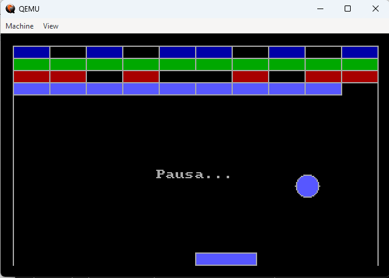

# Breakout - ASM16
<p>
    O <b>código fonte</b> em assembly está na pasta "assembly" na raiz do projeto. A <b>pasta "src"</b> tem apenas alguns <b>utilitários</b> feitos em Java para o processo de montagem     e geração das imagens. Foram utilizados o <b>nasm</b> como <b>assembler</b> e o sistema operacional <b>linux ubuntu</b> para o desenvolvimento.
</p>

<a href="https://www.italoinfo.com.br/projetos/breakout-assembly-16bits">Versão no italoinfo!</a>

<h2>Breve introdução</h2>

<p>
    Esta página trata de um jogo de breakout <b>produzido em puro assembly</b> com uso, apenas da 
    arquitetura de 16 bits. O que significa utilizar apenas os registradores e instruções 
    de 16 bits do <b>processador 8086</b>. Esse jogo funciona independente de sistema 
    operacional. Dado que, dá instruções diretamente ao BIOS do computador. Veja abaixo uma 
    captura de tela do jogo em funcionamento:
</p>



<h2>Como Rodar?</h2>

<p>
    Para jogar, basta baixar e gravar a imagem <b>"breakout-asm16-pendrive.img"</b> em um pendrive 
    ou HD, e <b>dar o boot</b> no computador pelo dispositivo onde a imagem foi gravada. A 
    versão <b>"breakout-asm16-pendrive.img"</b> é análoga a versão pendrive. Dado que, basta 
    gravar em um diskette e dar o boot por ele.
</p>

<h3>Rodando com emulador de computador</h3>

<p>
    Para executar, por exemplo, a imagem de pendrive pelo <b>qemu</b>, basta executar o seguinte comando:
</p>

```
qemu-system-x86_64 -m 4096 breakout-asm16-pendrive.img
```

<h2>Como Jogar?</h2>

<ul>
    <li>
        <p>
            Para jogar, basta utilizar as <b>setas</b> (traz e frente) do teclado para 
            <b>movimentar a raquete</b> e rebater a bolinha com o objetivo de destruir os 
            quadradinhos retangulares.
        </p>
    </li>
    <li>
        <p>
            Use o <b>enter para pausar</b> e o <b>ESC para reiniciar</b> o jogo.
        </p>
    </li>
    <li>
        <p>
            O ângulo do trajeto da bolinha em linha reta pode ser alterado se a bolinha 
            for rebatida mais à esquerda ou mais à direita da raquete!
        </p>
    </li>
    <li>
        <p>
            <b>Você perde</b> se a bolinha bater na parte de baixo (ao lado da raquete)!
        </p>
    </li>
</ul>

<br />
<h2><b>Como o jogo foi implementado?</b></h2>

<p>
    O <b>nasm</b> foi utilizado como assembler para montar o código objeto do software.
</p>

<h3>Suporte à instruções de 32 bits</h3>

<p>
    Para ser possível utilizar números de <b>32 bits</b> de tipo inteiro e até de 
    <b>ponto flutuante</b>, foi necessário implementar instruções que tratassem dados 
    armazenados em dois <b>registradores de 16 bits</b> para formar <b>um número de 32 bits</b>.
</p>

<p>
    Também foram implementadas funções de deslocamento de bits para dados de 32 bits, armazenados 
    em dois registradores de 16 bits.
</p>

<h3>Sem unidade de ponto flutuante</h3>

<p>
    O <b>processador 8086</b> não dispõe de <b>unidade de ponto flutuante</b>. Logo, tem suporte 
    apenas à instruções envolvendo representações de números inteiros em registradores de 
    16 bits. Dado isto, foi necessário implementar o padrão de representação de números em 
    <b>ponto flutuante</b> de precisão simples: <b>O IEEE754</b>.
</p>

<p>
    Foi necessário desenvolver a represtentação de <b>sinal, expoente e mantissa</b> em dois registradores 
    de 16 bits cada, para compor um número de 32 bits. 1 bit para o sinal, 8 bits para o expoente e os demais 
    23 bits para a mantissa. Os <b>operadores matemáticos básicos</b> para números de ponto flutuante 
    representados nesse formato também foram implementados. Isto é, soma, subtração, multiplicação 
    e divisão.
</p>

<h3>As funções matemáticas de 32 bits</h3>

<p>
    Foram implementadas as <b>funções básicas de operação</b> com números de <b>32 bits</b>,  
    armazenados em duas unidades de <b>16 bits</b>. Tais funções são: soma, subtração, multiplicação, divisão e de 
    <b>deslocamento de bits</b>.
</p>

<p>
    Foram implementadas também, as <b>funções matemáticas</b> de arredondamento, truncamento, potência, 
    raiz quadrada, e funções trigonométricas. Todas essas funções têm suporte aos números 
    de <b>ponto flutuante</b> representados conforme descrito na seção anterior.
</p>

<p>
    As <b>funções de potência</b> têm suporte a números positivos, negativos, de ponto flutuante com 
    expoentes que também podem ser números positivos, negativos ou de ponto flutuante. O mesmo 
    para a função de <b>raiz quadrada</b> e as <b>trigonométricas</b>. As de arredondamento e 
    truncamento, convertem um número de ponto flutuante em número inteiro de 32 bits.
</p>

<h3>Funções gráficas</h3>

<p>
    Foram implementadas também <b>funções gráficas</b> para <b>desenhar e/ou preencher</b>: 
    pontos, linhas, retangulos e círculos. Para tanto, foram utilizadas as funções matemáticas 
    descritas na seção anterior, bem como, os cálculos dos pontos (pixels) representantes da forma 
    a ser desenhada ou pintada.
</p>

<p>
    Foi implementada também a técnica de <b>double buffering</b> para que o desenho dos gráficos não 
    tivesse o <b>efeito de piscar</b>. Logo, ao invés de chamar a devida interrupção da bios para 
    pintar todos os píxels a serem mostrados em um determinado instante, se armazena todos os pixels 
    primeiro em uma <b>região da memória principal</b> e, depois, transfere-se esses dados para uma 
    <b>região especial da memória</b> que, dependendo do <b>modo de vídeo</b> escolhido, essa região 
    de memória é lida e as <b>cores dos píxels</b> são pintadas na tela de uma vez só.
</p>

<h3>Séries de tailor</h3>

<p>
    As <b>séries de tailor</b> são uma tentativa de se aproximar uma soma de termos de um polinômio 
    do resultado de uma função. As séries costumam ser <b>infinitas</b>. Logo, quanto maior o número 
    de termos, mais <b>próximo do valor real</b> é o resultado da função.
</p>

<p>
    As <b>séries de tailor</b> foram utilizadas para o <b>cálculo aproximado</b> das 
    <b>funções matemáticas</b> de potência, raiz quadrada e funções trigonométricas. Dado que, 
    a <b>arquitetura 8086</b> não dispõe dessas funções. Em relação as funções trigonométricas, 
    as séries de tailor para as funções: seno, cosseno, só têm um valor aproximado, em torno de, 
    entre, 0° e 90°. Logo, foram feitos cálculos de simetria e espelhamento para os ângulos dos 
    demais quadrantes.
</p>

<h3>O jogo de breakout</h3>

<p>
    O <b>jogo de breakout</b> utiliza as funções descritas anteriormente. Isto é, as 
    <b>funções gráficas</b> para que se possa visualizar os gráficos do jogo, e as 
    <b>funções matemáticas</b> e números de <b>ponto flutuante</b>.
</p>

<p>
    <b>Conceitos de física</b> como, <b>reflexão</b> em linha reta e alteração do 
    ângulo de reflexão, foram utilizados para o <b>movimento da bolinha</b> no jogo. 
    Foi tratada também a detecção de colisão entre a bolinha, os quadradinhos, 
    a raquete e as paredes.
</b>

<p>
    Foi implementado o <b>mecanismo de pausa</b> que para a execução do jogo e movimentos 
    da bolinha. 
</p>

<p>
    O Jogo tem também suporte ao <b>reinicio</b> que acontece quando a tecla ESC 
    é pressionada.
</p>
